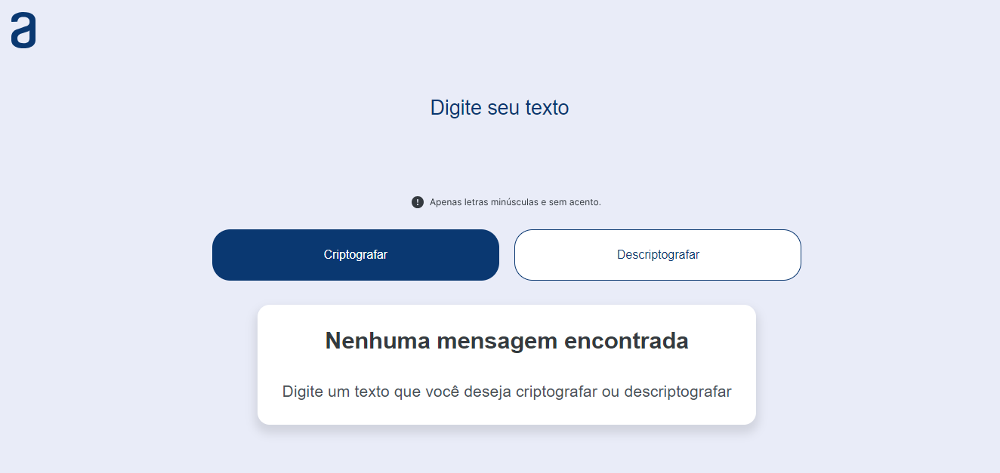
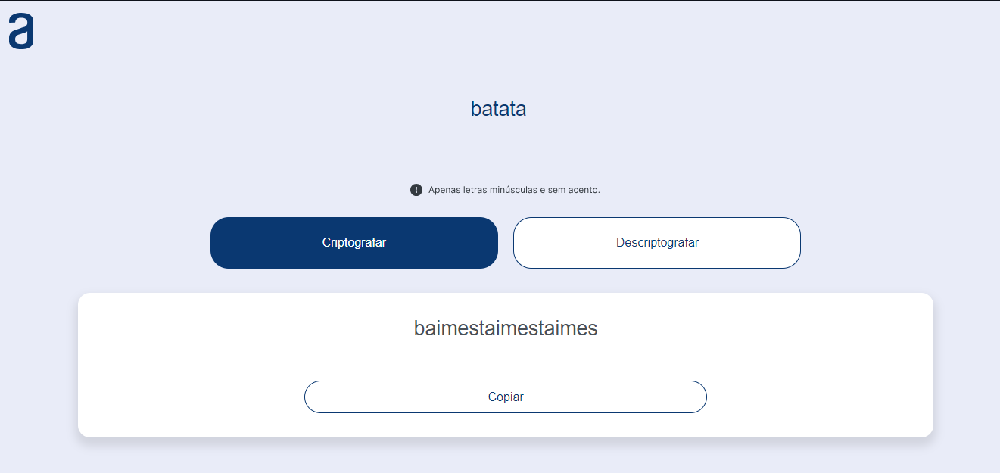
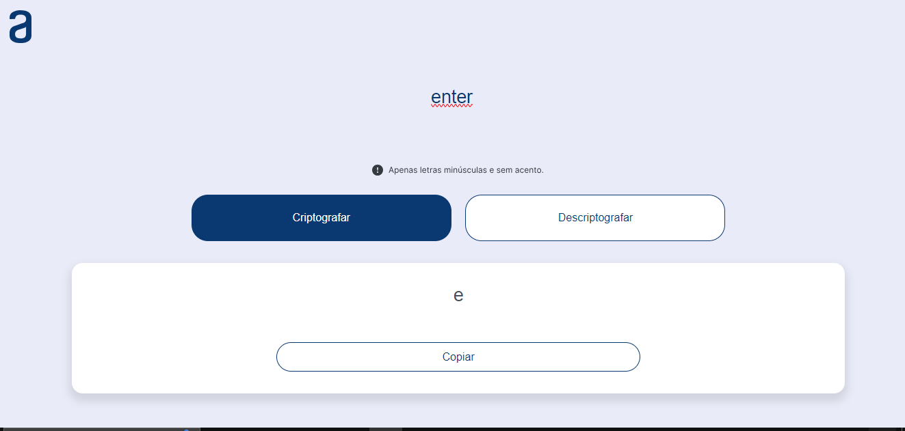

# Criptografador/Descriptografador de Texto

Este é um aplicativo simples que permite criptografar e descriptografar texto usando substituições de palavras.

## Funcionalidades

- Criptografar texto: Transforma o texto de entrada em uma versão criptografada, substituindo cada palavra por uma sequência única.
- Descriptografar texto: Desfaz a criptografia, substituindo cada sequência única pelas palavras originais.

## Como Usar

1. Abra o arquivo `index.html` em qualquer navegador da web.
2. Digite o texto que deseja criptografar ou descriptografar na área de texto fornecida.
3. Clique no botão "criptografar" para criptografar o texto ou no botão "descriptografar" para descriptografar o texto.
4. O texto criptografado ou descriptografado será exibido na área de resultado.
5. Se desejar copiar o texto resultante, clique no botão "Copiar".

## Capturas de Tela

- 
- 
- 

## Notas

- Certifique-se de não compartilhar a sequência de criptografia com terceiros, pois isso pode comprometer a segurança dos seus dados.
- Este aplicativo é apenas para fins educacionais e não deve ser usado para proteger informações sensíveis.